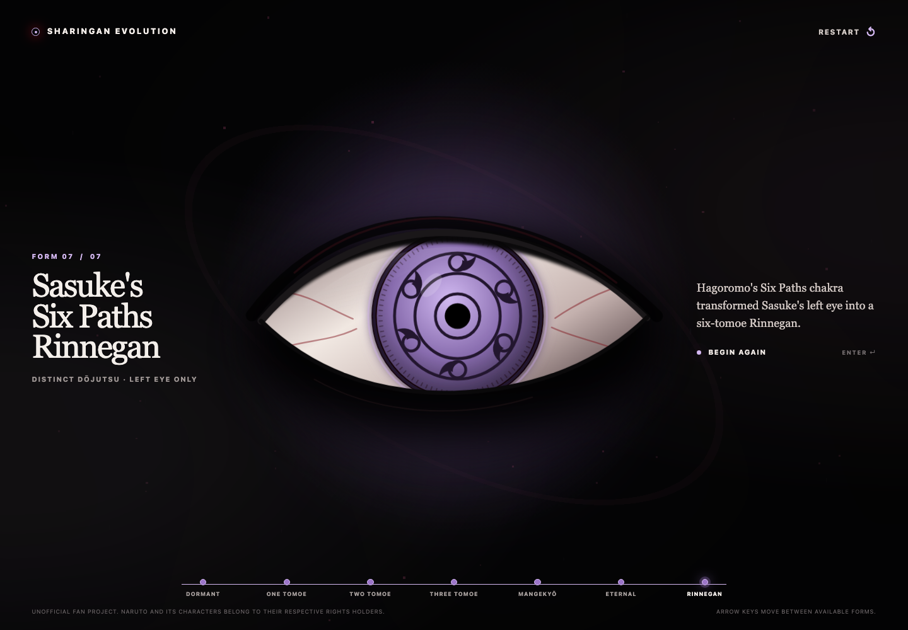

# Sharingan Evolution

A cinematic, full-screen fan experience tracing Sasuke Uchiha's eye progression from a dormant eye to his Six Paths Rinnegan.



The experience uses original SVG drawing, CSS atmosphere, and lightweight motion. It includes no copied anime frames, logos, music, franchise fonts, or other ripped assets.

## Experience

The seven data-defined forms are:

1. Dormant Eye
2. One Tomoe Sharingan
3. Two Tomoe Sharingan
4. Three Tomoe Sharingan
5. Mangekyō Sharingan
6. Eternal Mangekyō Sharingan
7. Sasuke's Six Paths Rinnegan

The final state is deliberately labeled **Distinct dōjutsu · Left eye only**. Sasuke's Rinnegan follows the Sharingan sequence in his story, but it is not presented as another Sharingan form.

## Controls

- Select the eye to advance one form. This works with a mouse, touch, `Enter`, or `Space`.
- Use `Arrow Right` to advance and `Arrow Left` to step back when focus is not already on a control.
- Use the progress rail to revisit any discovered form.
- Select **Restart** at any time, or select the final eye to begin again.

Each form transforms inside the same continuously mounted eye: the iris symbols scale and turn into place without crossfading or replacing the full eye canvas. The interface also has visible keyboard focus states, semantic controls, live stage announcements, readable contrast, phone-through-desktop layouts, and a `prefers-reduced-motion` mode that removes continuous particles, depth response, and transition travel.

## Local setup

Requires Node.js 22 or newer.

```bash
npm install
npm run dev
```

Open the local address printed by Vite.

## Verification

```bash
npm run lint
npm run typecheck
npm run test
npm run build
npx playwright install chromium
npm run test:e2e
```

`npm run check` runs linting, strict type checking, behavior tests, and the production build in one command. GitHub Actions runs that quality gate and the Chromium smoke suite for pull requests and `main`.

Behavior coverage includes sequential progression, persistent in-place eye transformations, Mangekyō-to-Eternal artwork continuity, pointer and native keyboard activation, direct navigation after discovery, restart, accurate Rinnegan distinction, locked-state accessibility, reduced-motion behavior, real touch input, phone layout, and browser-level keyboard operation.

## Visual proof

Review artifacts are in [`artifacts/visual-proof`](artifacts/visual-proof):

- 1440×1000 dormant desktop poster
- 1440×1000 corrected two-tomoe, Mangekyō, and Eternal Mangekyō states
- 1440×1000 fully discovered Rinnegan state
- 390×844 touch-sized corrected Mangekyō state
- before-and-after evidence for the advanced-eye redraw
- a concise written verification checklist

## Lore and IP boundary

The short lore lines follow Sasuke's canonical progression: early tomoe maturation, the fully matured Sharingan at the Valley of the End, Mangekyō after the truth of Itachi's sacrifice, Eternal Mangekyō through Itachi's transplanted eyes, and the six-tomoe Rinnegan in Sasuke's left eye after receiving Hagoromo's chakra. The Rinnegan distinction is also encoded directly in the UI and tested.

This is an unofficial, non-commercial fan project. Naruto and its characters belong to their respective rights holders. All interface artwork and effects in this repository are original code-created interpretations and are not official franchise assets.
